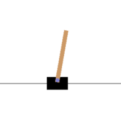

# gym-agents
RL &amp; Control Agents for OpenAI Gym Environments (Classic Control, Atari, Etc)

## Different RL/Control Agents (algos)
- Off-policy Q-function Learning
  - [DQN Agent](/rl)
  
   
- Actor-critic Methods
- On-policy Policy Gradient Algorithms
  - TRPO Agent
  - PPO Agent
- Control (followed by some assumptions)
  - [LQR Agent](/control)
  
  
- *misc*
  - [*Random Agent*](/misc/random_agent.py)
