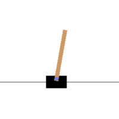

**This directory contains different control agents for gym environment.**

## LQR Agent
LQR algorithm is used to find optimal actions in a linear quadratic system, using an [algebraic Riccati equation](https://en.wikipedia.org/wiki/Algebraic_Riccati_equation)

The [example jupyter notebook](../control_example.ipynb) shows how this agent can be used for stabilization in a continuous cartpole environment with a bounded action space.

- **stabilization**

(Other algorithms will be updated in the later version)
