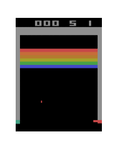
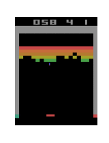

**This directory contains different RL agents for gym environment.**

## DQN Agent
DQN Agent leverages neural networks (Dense, CNN, etc) to estimate q-values for each state-action pair in the environmnent.

It iteratively collects experience (s, a, r, s*), add it to a replay buffer, and train Deep Q-Network with a minibatch from the buffer. 

The [example jupyter notebook](../rl_example.ipynb) shows how the DQL agent can be used to play/solve Atari pong environment.
Below gif files show the sample result of the trained agent.

- **early stage**

- **later stage**

(Other algorithms will be updated in the later version)
